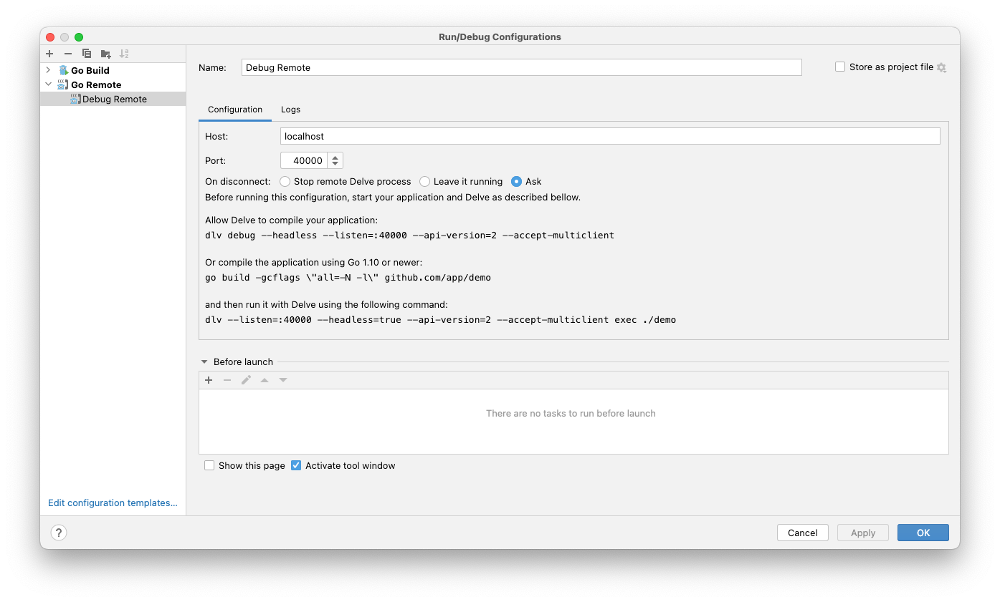

# Subscriptions POC

### Local Setup

##### First Time?

```
  brew install tilt
  brew install k3d
  brew install kubectx 
  brew install istioctl
  brew install jq
  brew install redpanda-data/tap/redpanda
  
  mkdir -p /tmp/k3dvol/  
  k3d cluster create factory --image rancher/k3s:v1.20.15-k3s1 --volume /tmp/k3dvol:/tmp/k3dvol --registry-create local-factory-registry -p "30001:30001@loadbalancer"
  kubectl create ns subscriptions
  kubens subscriptions
  kubectl label namespace subscriptions istio-injection=enabled
  
  helm repo add jetstack https://charts.jetstack.io && \
  helm repo update && \
  helm install \
  cert-manager jetstack/cert-manager \
  --namespace cert-manager \
  --create-namespace \
  --version v1.2.0 \
  --set installCRDs=true
  
  
  helm repo add redpanda https://charts.vectorized.io/ && \
  helm repo update
  
  export VERSION=$(curl -s https://api.github.com/repos/redpanda-data/redpanda/releases/latest | jq -r .tag_name)
  
  For Bash:
    kubectl apply \
    -k https://github.com/redpanda-data/redpanda/src/go/k8s/config/crd?ref=$VERSION

    For zsh:
    noglob kubectl apply \
    -k https://github.com/redpanda-data/redpanda/src/go/k8s/config/crd?ref=$VERSION
    
    
    helm install \
    redpanda-operator \
    redpanda/redpanda-operator \
    --namespace redpanda-system \
    --create-namespace \
    --version $VERSION
    
    kubectl create ns redpanda
    
    
    kubectl apply \
    -n redpanda \
    -f https://raw.githubusercontent.com/redpanda-data/redpanda/dev/src/go/k8s/config/samples/one_node_external.yaml
    
    Add this line to /etc/hosts file
    127.0.0.1 0.local.rp
    
    
    rpk topic create subscription-evaluation -p 1 --brokers localhost:30001
    rpk topic create subscription-change -p 1 --brokers localhost:30001
    rpk topic produce subscription-evaluation --brokers localhost:30001
    rpk topic consume subscription-evaluation --brokers localhost:30001
    rpk topic list --brokers localhost:30001

```

##### To run locally in K3d:

```
  ./run.sh
```

##### To run locally in docker

```
  ./run-docker.sh
```

##### To remote debug locally in docker

```
  ./run-docker.sh debug
```
- Then add the following configuration in Goland (TODO also add instructions for VScode)

